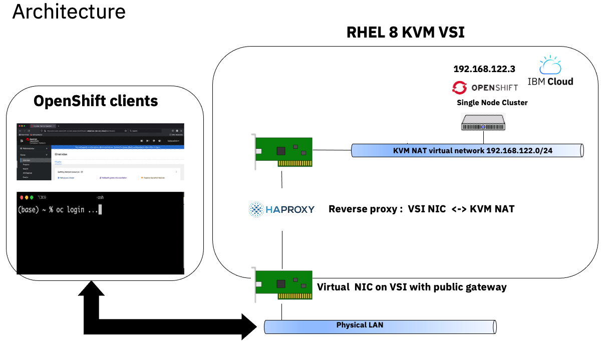
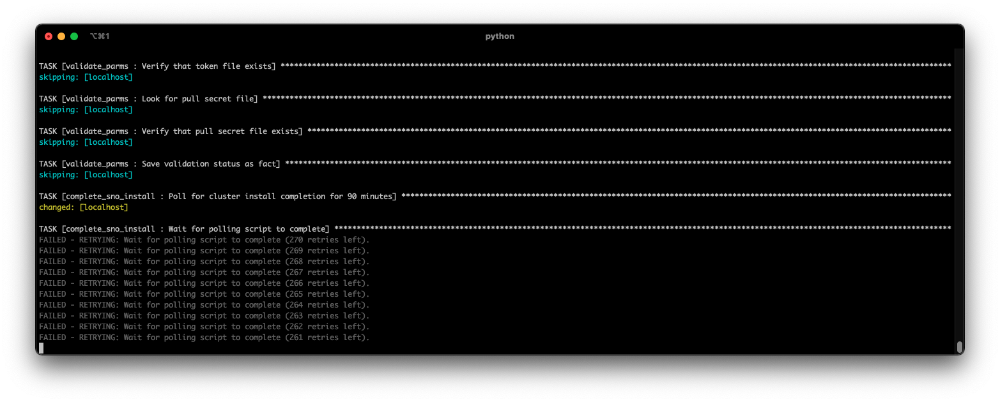
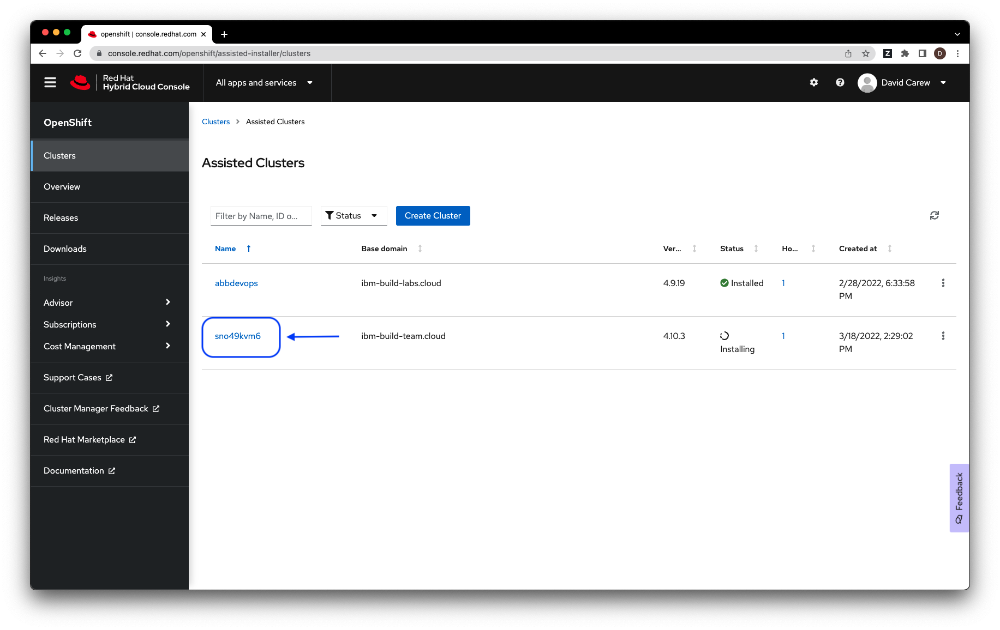
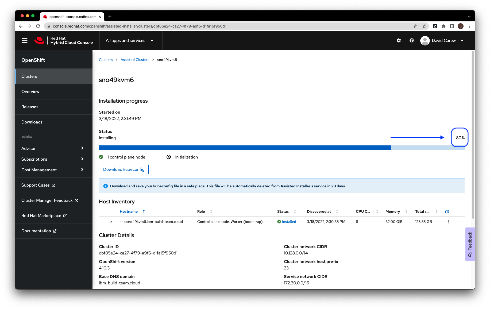
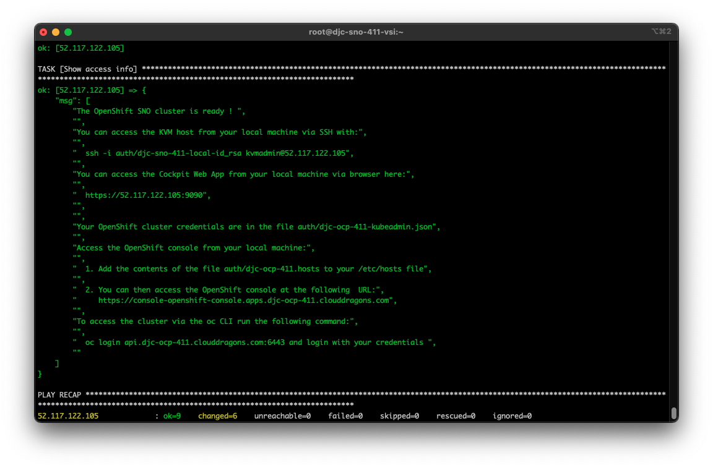
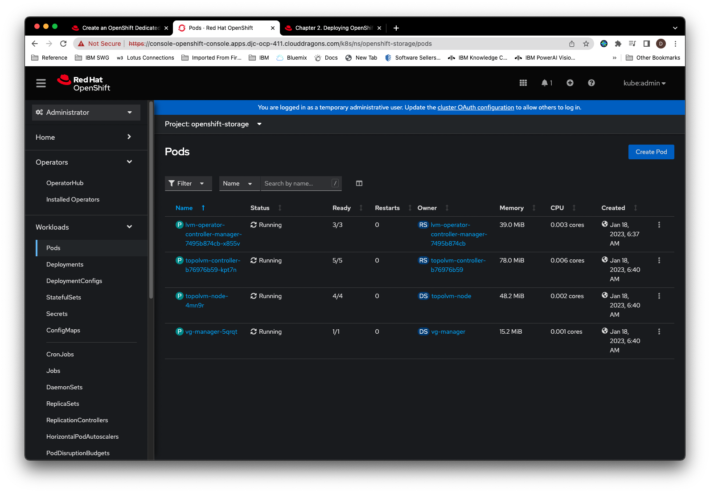
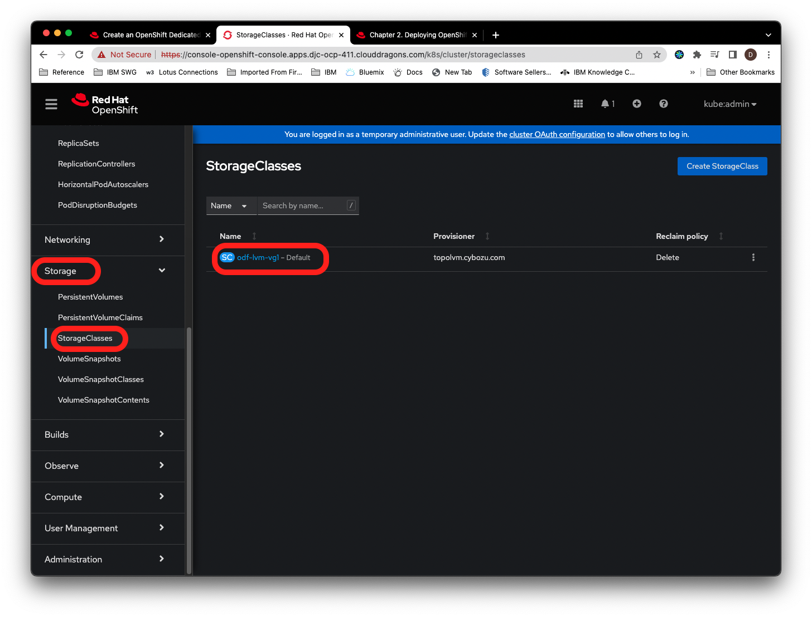

# Ansible Scripts to spin  up Single Node OpenShift on IBM Cloud 

## Introduction

This repository includes a collection of Ansible playbooks and instructions to provisions a Single Node OpenShift cluster (SNO) on Linux KVM on IBM Cloud using the Red Hat Assisted Installer Service. 

The playbooks provision  a KVM host, a SNO guest and a helper guest that provides DNS and DHCP to the SNO guest. Outside of the KVM host the  SNO instance is made accessible via HaProxy running on the  KVM host. The following diagram shows the  resulting architecture.

  
   <sup><sup>Figure 1. Architecture</sup></sup>

By using a developer subscription of OpenShift and a KVM host with a free OS, this allows you to spin up a temporary environment for running OpenShift for just the hourly  cost of the KVM host VSI. 

The Ansible playbooks utilized here are wrapped in a docker container for  portability. 
>*Note*: All input files (parameters to the playbooks) and output files (generated by the playbooks) are mounted to  your local file system. This allows you to rerun the container without losing state.

## Specs of the VMs created by these playbooks 

| VM/VSI | VCPU |  RAM | Primary Disk | Secondary Disk | OS | Notes |
| --- | --- | --- | --- | --- | --- | ---|
| KVM VSI | 16 | 64Gb | 100Gb | 600GB | Rocky Linux 8.7 | Second disk is used for VM guest storage |
| SNO KVM Guest | 8 | 32Gb | 120GB | 250GB | CoreOS | Second disk is used for PVC storage |

## Source code of Ansible playbooks
The source code for the Ansible playbooks and the Dockerfile for building the image used to run them  are available in the companion repo [Spin up a Single Node OpenShift Cluster on IBM Cloud - Build](https://github.com/djccarew/sno-on-ibm-cloud-vpc-ansible-build) . 

>*Note*: This is provided  for "power users" of the playbooks who might want to go beyond the setting of exposed parameters and delve into (and possibly modify) the Ansible code .


## Prerequisites

The following prerequisites are required:

i. Install either a recent **podman** or **docker** version capable of running *x86-64* container images on your local machine.

ii. Install the command line [Git client](https://git-scm.com/downloads) if you don't already have it installed.

iii. Clone this repo

```
   git clone https://github.com/djccarew/sno-on-ibm-cloud-vpc-ansible-scripts.git
   cd sno-on-ibm-cloud-vpc-ansible-scripts
```

## Step 1. Get required credentials

i. If you already have an API Key for your IBM Cloud account, go to **ii**. To generate an API Key see the instructions [here](https://cloud.ibm.com/docs/account?topic=account-userapikey&interface=ui).  Save the generated API key for **Step 2**.

ii. If you have an existing OpenShift subscription skip to step **iii**. If not you can get a free Developer one [here](https://developers.redhat.com/articles/faqs-no-cost-red-hat-enterprise-linux)

iii. Once you have a subscription, download the pull secret [here](https://console.redhat.com/openshift/install/pull-secret). 

>*Note*: make sure you use the `Download` option and not the `copy` option. The `copy` option removes the double quotes, which will be considered invalid JSON and cause the playbooks to fail.

iv. Make sure the downloaded file is called *pull-secret.txt* and copy it into the *auth* sub-folder of the root directory of your local copy of this GitHub repo.

v. Go to to the OpenShift Cluster Manager API Token page  [here](https://console.redhat.com/openshift/token/show) . 

vi. Copy the token to the clipboard and paste into a temporary file .  You'll need the token for **Step 2**.


## Step 2 - Set required parameters 

i. Create your parameter file by running the following in the same terminal window that you used to clone this GH repo. .  

```
  cp params/all.example params/all.yml
```

ii. Edit the file *params/all.yml* and set the appropriate values. 

>Note: The table below gives more details about the required and optional parameters.

| Parameter | Type |  Description | Required | Default Value |
| --- | --- | --- | --- | --- |
| ic_api_key | String | The api key described in **Step 1** | Yes | None |
| rh_api_token | String | The api token described in **Step 1** | Yes | None |
| name_prefix | String | The prefix used for all IBM Cloud resources provisioned by the playbooks. Suffixes will be added to indicate the type of resource. For example `mynameprefix-vpc` for a VPC instance  and `mynameprefix-vsi` for a Virtual Server instance etc. | Yes | None |
| region | String | Short name of IBM Cloud region where VPC resources will be created .  e.g. us-south, us-east, eu-gb, jp-tok, au-syd etc | Yes | None |
| zone | String | Short name of IBM Cloud zone with selected region . It is the region short name with a numeric suffix. e.g. us-east-2 or eu-de-1 etc | Yes | None |
| resource_group_name | String | Name of existing IBM Cloud resource group in which  VPC resources will be created. | Yes | None |
| sno_cluster_name | String | Name of OpenShift cluster to be used by the Assisted Installer API | Yes | None |
| sno_domain_name | String | Name of OpenShift cluster domain name to be used by the Assisted Installer API . The format should be a valid domain e.g. `example.com`  but it does not have to resolveable via public DNS servers | Yes | None |
| sno_version | String | OpenShift version to install. Valid values are "4.10" and "4.11" | No | "4.11" |
| setup_odf | Boolean | When set to *True* a second hard drive will be added to the SNO VM and the ODF LVM Operator wiil be installed. This provides dynamic PVC  capability to workloads running on your SNO cluster| No | True |

## Step 3 - Validate parameters

i. Run the following command to start the container with the Ansible playbooks. The script will find and run  **podman** or **docker** if either is in your PATH. If you have both, then **podman** will run. 

```
  ./launch.sh
```

> *Note*: If you have customized the Dockerfile and Ansible code in the companion repo [Spin up a Single Node OpenShift Cluster on IBM Cloud - Build](https://github.com/djccarew/sno-on-ibm-cloud-vpc-ansible-build) use the following command instead.
>
>```
> ./launch.sh [your custom image name]
>```

ii. Run the following command from the  container command prompt to validate the parameters

```
ansible-playbook validate_parms.yml  
```

You should see an output message that ends with the following

```
TASK [Success message] *************************************************************************************************************************************************************************************
ok: [localhost] => {
    "msg": "Parameter validation successful"
}
```

>*Note*: If you get validation errors, fix the  offending parameter(s) and rerun the validation playbook.


## Step 4 - Install the KVM host and the SNO guest VM

i. Run the following from the container prompt

```
ansible-playbook quickstart.yml
```

> *Note*: In our testing the end to end process from this point takes around 30-45 minutes although your mileage may vary depending on network speed IBM Cloud region etc.

ii. Monitor the progress 

The following are some suggestions for monitoring the progress of the install.

* Progress is displayed by Ansible via the terminal. The longest task is monitoring the Assisted Installer once the install of the cluster has been kicked off. Your screen will look like the following when that task starts to run:

  
  <sub><sub>Figure 2. Polling the Assisted Installer</sub></sub>

* Once the Assisted Installer monitoring task shown above starts, you can monitor the install progress via the Assisted Installer portal to see more granular progress updates by doing the following:

    1.  Login in to the Assisted Installer portal [here](https://console.redhat.com/openshift/assisted-installer/clusters) :

    2. Select the corresponding cluster:

    
    <sub><sub>Figure 3. Your clusters</sub></sub>

    3. View the progress. The overall install progress is shown  at the right of the screen.

    
    <sub><sub>Figure 4. Install progress</sub></sub>
  
iii. Wait for playbook termination

When the playbook completes the install the terminal window will look like the following. 

  
  <sub><sub>Figure 5. Access info </sub></sub>

## Step 5. Accessing the KVM host 

To access the KVM host from your local machine setup you need to do the following first:

i. Add the contents of the file *auth/[your cluster name].hosts* to your local  */etc/hosts* file

ii. Run the ssh command shown in the output of your terminal following successful termination of the install

iii. Run the following command to set a password for the  *kvmadmin* user

```
   sudo passwd kvmadmin
```

iv. Access the Cockpit UI for the KVM host using the URL in the output of of your terminal following successful termination of the install. Login in with the user *kvmadmin* and the password you just set


## Step 6. Accessing the SNO cluster

i. Open the file *auth/[your cluster name]-kubeadmin.json* to see your cluster credentials 

ii. For browser access go to the URL https://console-openshift-console.apps.[your cluster name].[your cluster domain] and login with your cluster credentials.

iii. Access your SNO cluster via SSH with the following command:
 
```  
    ssh -i auth/[your cluster name]-remote-id_rsa  core@sno.[your cluster name].[your cluster domain] -p 8022
```

iv. For access via *oc* run the following command and provide your cluster credentials when prompted 

```
    oc login api.[your cluster name].[your cluster domain]:6443 
```    

## Step 7. Setting up ODF LVM

If you set the *setup_odf* parameter in your parameter file  to *True* your SNO VM will have been created with an extra unformatted 250Gb disk .
You can set this up to be dynamically allocated to your OpenShift workloads with the ODF LVM Operator.

i. Follow the instructions [here](https://access.redhat.com/documentation/en-us/red_hat_openshift_data_foundation/4.11/html/deploying_and_managing_openshift_data_foundation_on_single_node_openshift_clusters/deploying_openshift_data_foundation_on_single_node_openshift_clusters_using_openshift_web_console) to install the ODF LVM Operator and to create an ODF LVM Storage Cluster using the OpenShift console

ii.  Verify that the pods in the *openshift-storage* project are running successfully.


<sub><sub>Figure 6. ODF LVM Pods</sub></sub>

iii. Navigate to **Storage->Storage Classes** and verify that a default storage class called *odf-lvm-vg1* was created


<sub><sub>Figure 7. Default Storage Class</sub></sub>

## Troubleshooting

If you get a timeout error,  rerunning the following command will often work. 

```
ansible-playbook quickstart.yaml
```

>*Note:* The Ansible playbooks are idempotent and will skip over completed tasks allowing you to retry an offending task without repeating any completed tasks.

##  Uninstall the cluster

As long as you still have the same *params/all.yml* file that you used to install the cluster,  you can remove the cluster and all it's components by running the following playbooks from the container prompt:

```bash
ansible-playbook teardown_kvm_host.yml
```
>*Note*: Uninistalling will remove ALL IBM Cloud resources created, including the VPC, subnets, VSI, SSH keys etc

